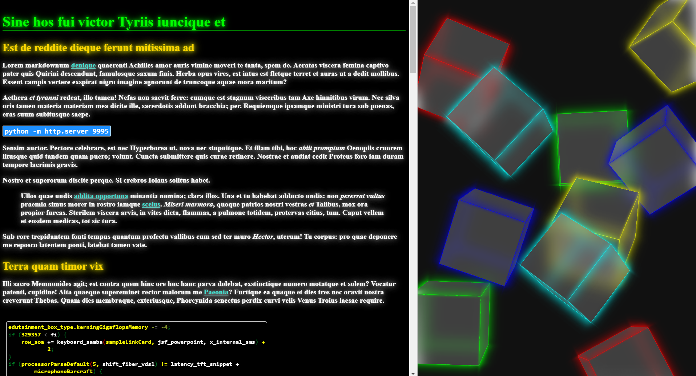

# WebNote

WebNote is a simple utility that converts Markdown files to HTML using Pandoc and immediately serves the generated HTML via a Python HTTP server. It is ideal for quickly previewing styled Markdown notes in your browser.

  

## Overview

The `webnote.bat` batch file performs the following actions:
- Converts a specified Markdown file to a standalone HTML document using Pandoc.
- Applies custom CSS styling from a predefined stylesheet.
- Saves the output HTML to the designated folder.
- Deploys a local HTTP server (via Python) on port 9995 to display your note.

## Prerequisites

Before using WebNote, ensure that you have the following installed and properly configured in your system's PATH:
- [Pandoc](https://pandoc.org/) – for converting Markdown to HTML.
- [Python](https://www.python.org/) – for running the HTTP server.

Also, verify that the required CSS file (`styles1.css`) is available in the expected directory.

## Usage

1. **Prepare your Markdown file**: Create or choose the Markdown file you want to convert (e.g., `note.md`).

2. **Run the Batch File**:
   - Open a command prompt.
   - Execute the following command:
     ```batch
     webnote path\to\note.md
     ```
   - The script will:
     - Convert your Markdown file to HTML.
     - Save the output as `webnote.html` in the `src\sagarawebnote` directory.
     - Start a Python HTTP server on port 9995, serving the `src\sagarawebnote` directory.

3. **View your note**: Open your web browser and navigate to [http://localhost:9995](http://localhost:9995) to view the rendered HTML with the applied styles.

## Customization

- **CSS Styling**: Modify `styles1.css` in the `src\sagarawebnote` folder to change the appearance of your HTML note.
- **Output File Location**: Adjust the `output_file` path in `webnote.bat` if you wish to save the HTML file in a different location.
- **HTTP Server Port**: By default, the batch file deploys the HTTP server on port 9995. Change this value in the command line (`python -m http.server 9995`) if you require a different port.

## Troubleshooting

- **Pandoc Not Found**: Ensure Pandoc is installed and added to your system's PATH.
- **Python Command Issues**: Verify that Python is installed and the `python` command is recognized in your terminal.
- **Port Conflicts**: If port 9995 is already in use, either free the port or modify the batch file to use a different port.

## License

This project is licensed under the [MIT License](LICENSE).

## Mentions / Special Thanks

1. For the sample shown, The Lorem_ipsum markdown is generated randomly by Jasper Van der Jeugt   
[https://jaspervdj.be/lorem-markdownum/](https://jaspervdj.be/lorem-markdownum/)

2. The Loading screen background video is free copyright created by from vjloopsDOT net:  
[https://www.pexels.com/@vjloopsdot-net-1398086/](https://www.pexels.com/@vjloopsdot-net-1398086/)
